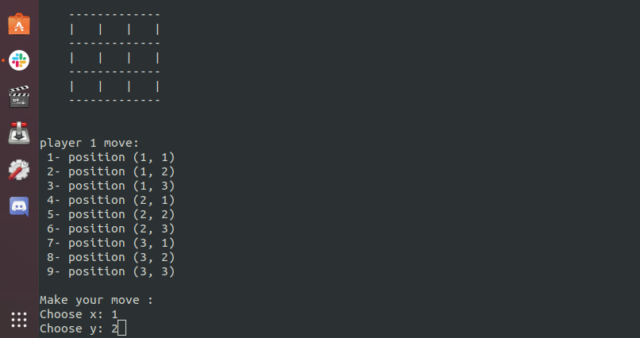

# OPP Project: TIC TAC TOE game

This project is a TIC TAC TOE game in Ruby.

## Live link

You can play the game on repl.it platform, skip enviroment set up section and follow how to play section

- [](https://repl.it/github/HADDADSOHAIB/OPP)

## Enviroment set up requirements

To run this game, you need ruby installed in your enviroment.
Run the following commend:

```
$ ruby -v
```

You should a have a result similar to this:

```
ruby 2.6.5p114 (2019-10-01 revision 67812) [x86_64-linux]
```

If you don't get that result, follow this [link](https://www.ruby-lang.org/en/documentation/installation/) and install Ruby in your local enviroment.

## How to play:

### Tic Tac Toe game rules:


- The game start with an empty board (image on the left).
- Player 1 start by one case using X and Player 2 continue by filling the next case using O symbol.
- The game continue until we have a winning combination (check images below) or the grid is full and it is a draw.
  
- Winning combinaison are full row, full column or full diagonal.

### Play the game:

- Use the live version on repl.it plateform above or clone this repository into your local enviroment and CD to the folder.
- Run this command:

```
$ ./bin/main.rb
```

- You have two option: 1 start new game or 2 quit the game.
- 
- The game start with an emty board and a score of player 1: 0 and player 2: 0
- 
- The game show the board status, whose player turn is and the possible moves. The player should choose x an y (x and y is the coordinate of the case the player want to fill). x: 1 and y: 1 is the top left case, x: 3 and y: 3 if the bottom right case.
- 
- The game continue until we get a winning combinaison or a draw.
- 
- If a player win, the score get increased and you have two options: Continue the game or Quit.
- 

## Built With

- Ruby

## Authors

👤 **HADDAD SOHAIB**

- Github: [@HADDADSOHAIB](https://github.com/HADDADSOHAIB)
- Twitter: [@HaddadSohaib](https://twitter.com/HaddadSohaib)
- Linkedin: [linkedin](https://www.linkedin.com/in/sohaibhaddad/)

👤 **Jabiro Christian**

- Github: [@jabichris](https://github.com/jabichis)
- Twitter: [@JabiroChristian](https://twitter.com/JabiroChristian)
- Linkedin: [Jabiro Christian](https://www.linkedin.com/in/jabiro-christian-b01054115/)

## 🤝 Contributing

Contributions, issues and feature requests are welcome!

Feel free to check the [issues page](issues/).

## Show your support

Give a ⭐️ if you like this project!

## 📝 License

This project is [MIT](https://haddad-sohaib.mit-license.org/) licensed.
